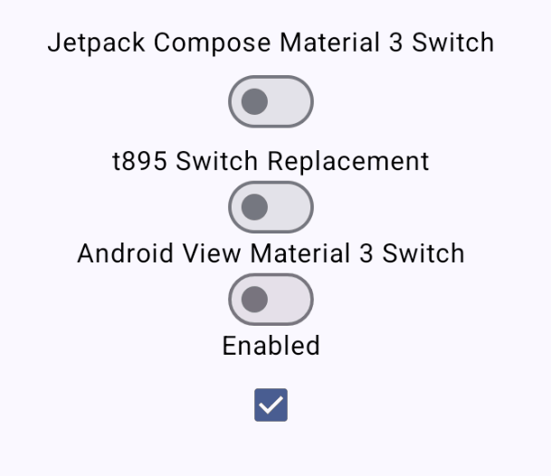

# Material Switch

~~Material 3 Switch accurately implemented to its design spec in Compose Multiplatform.
Intended to be a drop-in replacement for Jetpack Compose's Material 3 Switch.~~

This was originally meant to be an "accurate" implementation of the Material 3 Switch.
However, looking between several of the examples on m3.material.io, the animation specifications
for the switch are very inconsistent. Given that the compose team, the views team and Google's
partners (see Flutter) use different animations, I am opting to work on my own spec with inspiration
from what is on m3.material.io. It is still a drop-in replacement for the switch in Jetpack.

I made this because I generally dislike the Compose Material 3 Switch due to lacking
multiple animations and color states.

### Dependency

Works on all platforms that Compose multiplatform is available on
`implementation("io.github.t895:materialswitch:0.3.0")`

### Demo

### Build platform artifacts

#### Android aar

- Run `./gradlew :materialswitch:assembleRelease`
- Output: `/switch/build/outputs/aar/switch-release.aar`

#### JVM jar

- Run `./gradlew :materialswitch:jvmJar`
- Output: `/switch/build/libs/switch-jvm-1.0.jar`

#### iOS Framework

- Run `./gradlew :materialswitch:linkReleaseFrameworkIosArm64`
- Output: `/switch/build/bin/iosArm64/releaseFramework/switch.framework`
